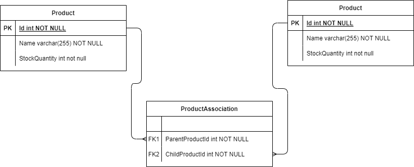

## Bike Bundles

# 1.Problem definition

## 1.1 Bundles

A bundle is a product that is composed of one or more products (aka bundle parts). An example of a bundle would be a bike. The bike is the bundle, bundle parts would be "wheel", "pedals", "seat", "frame", and "breaks". A bundle can have more than one unit of given part. Example, a product named Bike contains 2 units of product Wheel.

Bundles can be modeled into a tree structure where each node is a product that can also be a bundle of other products. A bike can be modeled in the following way:
- Bike with parts: 1 seat; 2 pedals; 2 breaks; 2 wheels.

# 2. Challenge
## 2.1 Problem statement

Input:
Given the following:
- A bundle has one or more parts;
- A bundle can contain other bundles;
- Leaf elements aka spare parts have an associated inventory count;
- Bundles are strinctly constructed from their respective parts inventory - you can only build as many bundles as the available spare parts allows.

Questions:
Write a program that computes the maximum number of finished bundles (P0) one can build. This program must be generic enough to process any bundle structure.

Test the input to verify your solution:
A bike is a bundle that is built of:
- One seat (thre are 50 in stock);
- Two pedals (there are 60 in stock);
- Two wheels. Each wheel has: a frame (there are 60 in stock); a tube (there are 35 in stock).
How many bikes can you build from the above inventory?

## 2.2 Database design

Database modeling:
Create a relational schema we can use to manage a bundle structure?
Please share the diagram drawing on a slide.

EF Core:
Create the necessary EF Core configuration files to map the schema to the bundle program you wrote earlier.

# 3. Implementation

## 3.1 Testing
### 3.1.1 ProductRepositoryTests
#### 3.1.1.1 CalculateBundlesFromStock

## 3.1 Database diagram
## 3.1.1 ProductAssociation

